<div align="center">



<br/>

**Type a GitHub username. Get a beautiful report card.**
Stars · Forks · Followers · Streaks · Languages · Grades — **no login, no API keys.**

[](https://YOUR-VERCEL-URL.vercel.app)
[](https://nextjs.org)
[](https://www.typescriptlang.org)
[](https://tailwindcss.com)
[](https://www.framer.com/motion/)

</div>

---

## 🎓 The Idea

In a world of dashboards and graphs, **GitDarpan** does something nostalgic — it turns your GitHub profile into a **vintage academic report card**. A warm cream marksheet on deep navy, graded in forest-green ink, stamped like a real record.

> *"Modern developer product + premium vintage academic record."*

## ✨ Features

| | |
|---|---|
| 🪪 **One-tap report card** | Type any username → instant marksheet |
| 🟩 **Real grades (C → S)** | Experience, Community, Popularity, Consistency, Versatility |
| 🔥 **Activity streak** | Computed from public GitHub events — no auth needed |
| 🎨 **Language breakdown** | Star-weighted bars with authentic language colors |
| ⭐ **Starred repos** | Your top repositories, front and center |
| 🖼️ **Download as PNG** | Share your marksheet anywhere, one tap |
| 🔑 **100% keyless** | GitHub's public REST API, zero config |
| 📱 **Mobile-first** | Editorial typography, zero overflow |

## 🧾 How Grading Works

Every subject is scored `C → B → B+ → A → A+ → S`:

| Subject | Measured by | Thresholds (B → S) |
|---|---|---|
| 📅 Experience | Years on GitHub | 1 · 2 · 4 · 6 yrs |
| 🤝 Community | Followers | 25 · 100 · 400 · 1500 |
| ⭐ Popularity | Total stars | 30 · 150 · 750 · 3000 |
| 🔥 Consistency | Day streak (90-day events) | 3 · 7 · 14 · 30 |
| 🧰 Versatility | Languages used | 2 · 3 · 4 · 6 |

Overall grade = rounded average. Then the **stamp slams down**. 🟢

## 🎨 Design System

`Navy #080F1C` · `Navy Soft #151F35` · `Cream #F8F4EA` · `Gold #D6A23A` · `Gold Bright #E8B84B` · `Graphite #101722` · `Smoke #85858A` · `Forest #24785F`

- **Type:** Fraunces (display serif) + Space Grotesk (body)
- **Feel:** premium · editorial · nostalgic · developer-focused

## 🚀 Getting Started

```bash
git clone https://github.com/YOUR-USERNAME/gitdarpan.git
cd gitdarpan
npm install
npm run dev
```

Open `http://localhost:3000` — that's it. **No `.env`, no keys, no signup.**

### Deploy to Vercel

1. Push this repo to GitHub
2. Import it on [vercel.com](https://vercel.com)
3. Deploy. Done. ☁️

## 📂 Project Structure
## 🔐 API & Rate Limits

GitDarpan uses GitHub's **public REST API** (keyless, ~60 req/hr per IP).
One report ≈ 3–5 requests. If you hit the limit, wait a minute — the card will be waiting.

## 🤝 Contributing

Fork it → branch it → ship it. Ideas: OG-image sharing, compare-two-users mode, PDF export, more grading curves.

## 📄 License

MIT — free to use, remix, and stamp.

---

<div align="center">

**Made with cream, gold & forest green.**
If GitDarpan made you smile, leave a ⭐ — it counts toward *your* Popularity grade. 😉

</div>
